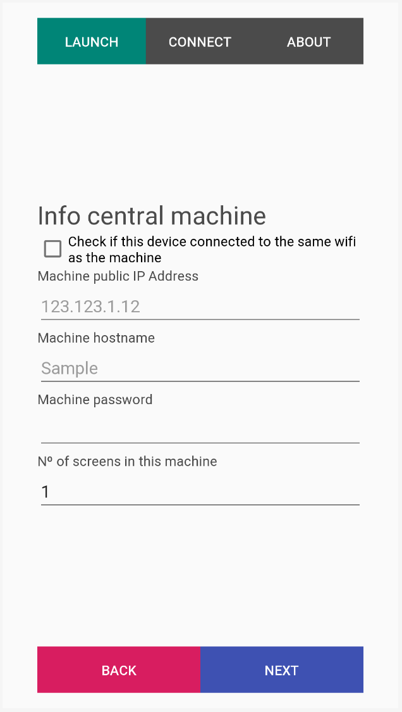
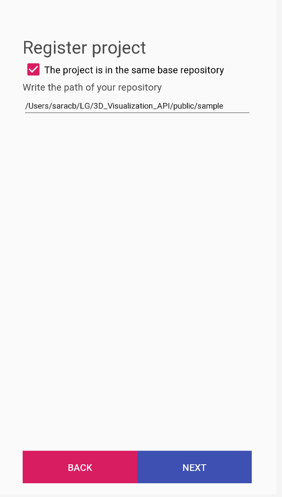
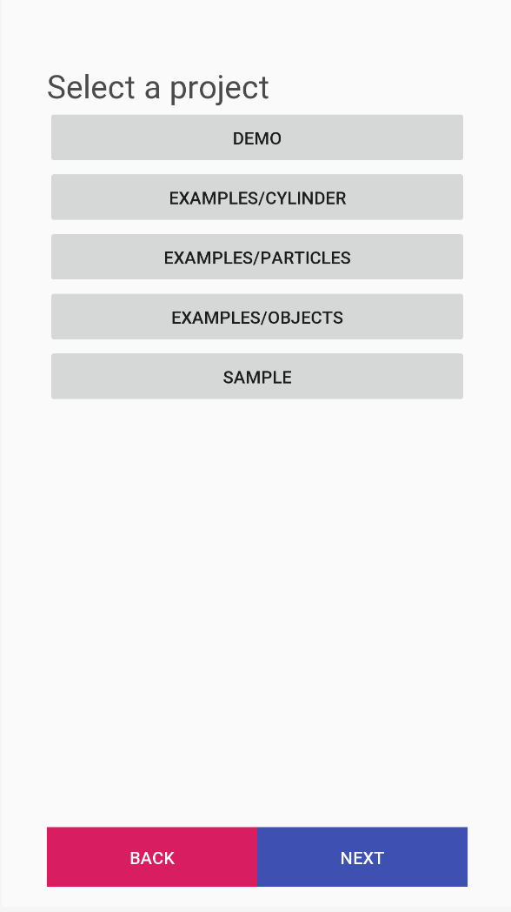
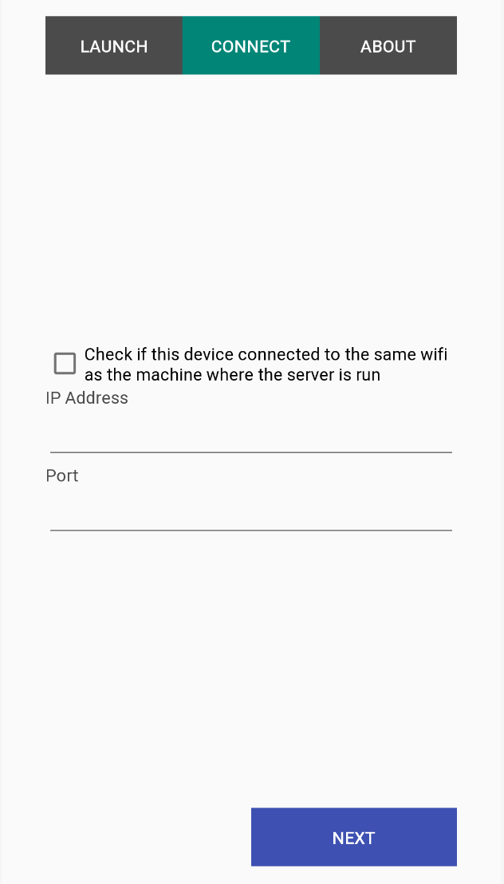
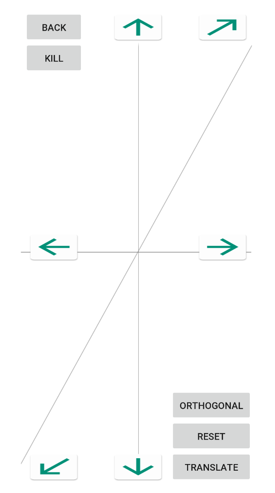

# 3D_Visualization_API
My project goal for this project is to create a software library that can be integrated in Liquid Galaxy, that allows third parties to easily apply common features in Computer Graphics directly to a Liquid Galaxy format, a multi screen display cluster launching instances of Chromium OS in each machine. This would include really commonly used properties in graphics, modelling a geometric object, applying lightning, animation, shaders and even textures.

## Prerequisites
* Node.js and npm

This project is created using Socket.io and you need to have Node and npm (node package manager) installed. If you do not have these, head over to Node setup to install node on your local system. Confirm that node and npm are installed by running the following commands in your terminal.
```
$ node --version
$ npm --version
```
And you should get something similar to
```
v5.0.0
3.5.2
```
* Google Chrome

## Installing manually

Installing manually is referred when running the project in a computer or multiple computers. Firstly run:

```
$ npm install
```
If there is problems running the last command try typing npm install -g nodemon

To run the server and see the project in a LG display, run the script launch.sh. To get more details run:

```
$ ./launch.sh -h
Usage: [-m] [-i IP_ADDRESS <default: localhost>] [-p PORT  <default: 3000>] [-n NUMBER_SOCKETS] [-t HEIGHT] [-w WIDTH] [-d DIRECTORY <default: .>]
```
Each argument means:

* -m → Master. Add if you want the current machine to launch the server and be the master of the project.
* -i IP_ADDRESS → Public IP Address where the server is running. If current machine is the master this argument does not need to be added
* -p PORT → Port where the server will be/is running. Default 3000.
* -n NUMBER_SOCKET → How many sockets (web browser) to open in THE SAME MACHINE.
* -t, -w → Dimensions of a single browser. By default these will be set to occupy the maximum of the screen monitor.
* -d → Path to animation project directory (relative to 'public' folder), this is where the file 'index.html' is found. Default is the public directory.


If the script fails due to the OS or different versions, you can run:
```
$ node app <port> <directory>
```
And then open a brown and go to http://localhost:<port>

### Example commands to run script launch.sh

#### Running project in a single machine 
Multiple browsers in a single machine

```
$ ./launch.sh -m -n 3 -d examples/objects
```
And it should look like:


If you are going for the second approach then you would run:
If the script fails due to the OS or different versions, you can run:
```
$ node app 3000 examples/objects
```
And then open http://localhost:3000

#### Running project in multiple machines
In a specific port.

On central machine with an ip addres <ip_central>:
```
$ ./launch.sh -m -p 3333 -d examples/cylinder
```

On the rest of machines, if you have cloned the repository you can:
```
$ ./launch.sh -i <ip_central> -p 3333
```
If you have not cloned the repository then you can open a browser and go to http://<ip_central>:3333

Remember that the order to launch rpojects should be the following:


### Killing  the server

If you run the launch.sh script and you want to be able to kill the server to run a different project then you can run:
```
$ ./killServer.sh
```

## How to create new project using this API

1. Create a file called 'index.html' insed the public folder of this repository.
2. Include the following tags outside the head and the body of the htmls:
```
<script src = "/socket.io/socket.io.js"></script>
<script src="https://threejs.org/build/three.js"></script>
<script src="https://ajax.googleapis.com/ajax/libs/jquery/3.5.1/jquery.min.js"></script>
```
3. Include tag inside the body with the right path to the 'main.js' file inside the public folder:
```
<script src="main.js"></script>
```
4. Any other JS files need to be in the public folder.

## API reference

* *var scene*
  * type → THREE.Scene
  * Description → Scene of the animation project

* *var camera*
  * type → THREE.OrthographicCamera or THREE.PerspectiveCamera 
  * Description → Camera of the animation scene

* *scale(object: Object3D, scaleX: Float, scaleY: Float, scaleZ:Float): void*
  * Description → It sets the object's local scale to ( x: scaleX, y: scaleY, z: scaleZ )

* *setColor(object: Object3D, color: Integer, colorWrite: boolean, vertexColor: boolean)*
  * Description → It sets the object's color to ( colorHex: color, colorWrite: colorWrite, vertexColor: vertexColor )

* *translate(object: Object3D, translateX: Float, translateY: Float, translateZ: Float): void*
  * Description → It sets the object's local position to ( x: translateX, y: translateY, z: translateZ )
* *addTranslation(object: Object3D, translateX: Float, translateY: Float, translateZ: Float): void*
  * Description → It **ADDS** the object's local position by( x: translateX, y: translateY, z: translateZ )
* *getOriginalPositionObject(object: Object3D): {x: object → positionX, y: object → positionY, z: object → positionZ}*
  * Description → It returns the object's local position

* *rotate(object: Object3D, rotateX: Float, rotateY: Float, rotateZ: Float): void*
  * Description → It sets the object's local rotation to ( x: rotateX, y: rotateY, z: rotateZ )
* *addRotation(object: Object3D, rotateX: Float, rotateY: Float, rotateZ: Float): void*
  * Description → It **ADDS** the object's local rotation by( x: rotateX, y: rotateY, z: rotateZ )
* *getOriginalRotationObject(object: Object3D): {x: object → rotationX, y: object → rotationY, z: object → rotationZ}*
  * Description → It returns the object's local rotation

  
## Android app

### Prerequesites
* npm i in master

You will still need to run in the master machine machine:
```
$ npm install
```
If there is problems running the last command try typing npm install -g nodemon

* Having Linux machines
* Being able to SSH to machine. 
* Android device with at least the KitKat version

* Download the app i: https://drive.google.com/file/d/15LZfCakYCRCmlKxijxa1iCYykL5pr35O/view?usp=sharing

### How to use

This app is programmed to remember the state it was left even when leaving the app.

#### Launch a server


To launch a server in a machine click on the top screen in the android app. The ckeckbox would fill the beginning of the "IP Address" section, but still needs to be completed., the IP Address needs to be the one of the central machine (the master).



Fill the information appropriately for each machine.


After filling the needed information, the app will go into the projects window. Here the list of projects registered would appear. You can register projects by clicking the "Register project" button



Fill with the path in your **Master** to the directory with the index.html file you want to run. The app will check that the directory is valid and then it would be registered




#### Connect to an already running server



To connect to an already running server click on the top screen in the android app. All the information that is asked on this section refers to the machine where the server is ran. The ckeckbox would fill the beginning of the "IP Address" section, but still needs to be completed.

## Controls
### In the computer
* w → moves forwards (translate camera negatively on the Z axis)
* s → moves backwards (translate camera positively on the Z axis)
* a → moves left (translate camera negatively on the X axis)
* d → moves right (translate camera positively on the X axis)
* space bar → moves up (translate camera positively on the Y axis)
* x →  moves down (translate camera negatively on the Y axis)
* left/right key → rotates around Y axis
* up/down key → rotates around X axis
* q/e → rotates arounds Z axis
* h → shows help message
* c → switch between orthogonal and perspective view

### In the android app


To mode of the arrows (translate and rotate) is represented in the botton right of the screen. To switch press the same buttons. 

The **'kill'** button is only shown when the app launched the server, and it would kill the server and go back. This would leave *the port where the server is run free*.

## Built With

* [Socket.io](https://socket.io/) - Library for web sockets
* [Threejs](https://threejs.org/) - Graphics library
